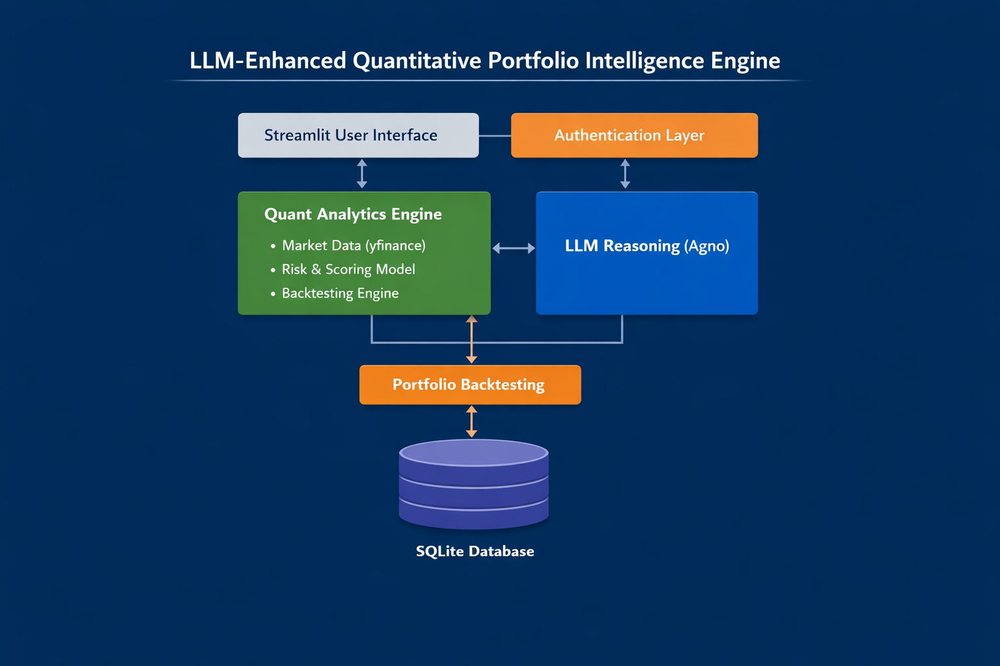

📊 LLM-Enhanced Quantitative Portfolio Intelligence Engine

  

A production-grade AI system combining LLM reasoning, systematic equity ranking, quantitative risk modeling, and walk-forward backtesting with secure authentication and persistent storage.

🚀 Overview

This project is an end-to-end AI-powered quantitative decision intelligence platform that integrates:

🧠 LLM reasoning (Agno framework)

📈 Multi-factor equity ranking engine

📊 Risk modeling (volatility, Sharpe ratio, drawdown)

🔄 Walk-forward backtesting

💾 Persistent storage (SQLite)

🔐 Role-based authentication (Admin / User)

💬 Financial chatbot interface (grounded, no hallucinations)

It demonstrates LLM + Quantitative Finance + Production Engineering in a unified system.

🏗️ Architecture

The system follows a layered architecture:

1️⃣ Interface Layer

Streamlit application

Financial chatbot UI

Ranking dashboard

Backtesting visualization

2️⃣ Authentication Layer

bcrypt password hashing

YAML credential storage

Role-based access control

Session management

3️⃣ Quant Analytics Engine

Market data ingestion (yfinance)

Feature engineering

Cross-sectional normalization

Multi-factor scoring

4️⃣ LLM Reasoning Layer (Agno)

Data-grounded reasoning

Evidence-based explanations

Strictly structured outputs

No synthetic financial data generation

5️⃣ Backtesting Engine

Rolling window optimization

Monthly rebalancing

Sharpe-optimized portfolio

Benchmark comparison

6️⃣ Storage Layer

SQLite database

Run history tracking

Snapshot persistence

Run comparison engine

📈 Quantitative Metrics Implemented

The engine computes:

1-Week Return

30-Day Return

Annualized Volatility (σ × √252)

Rolling 20-Day Volatility

Sharpe Ratio

Maximum Drawdown

Market Capitalization

Trailing P/E

Composite Multi-Factor Score

🏆 Multi-Factor Ranking Engine

The scoring engine supports customizable weights:

weights = {
    "market_cap": 0.3,
    "one_week_pct": 0.25,
    "ret_30d": 0.15,
    "trailing_pe": 0.15,
    "vol_ann": 0.15
}

Cross-sectional normalization ensures comparable scaling across features.

🔄 Walk-Forward Backtesting

The system simulates realistic portfolio construction:

Rolling lookback window

Monthly rebalance

Sharpe-optimized allocation

Equal-weight benchmark comparison

Equity curve visualization

Risk-adjusted performance comparison

🤖 LLM-Powered Financial Chatbot

Built with Agno, the chatbot:

Answers questions about ranking results

Explains risk metrics

Provides evidence-based insights

Operates only on computed dataset

Prevents hallucinated financial values

Example query:

“Why is AAPL ranked #1?”

The model explains based on:

Sharpe

Volatility

30D return

Market cap strength

Valuation metrics

🔐 Authentication & Roles

Supports:

Admin

Run comparisons

Backtesting controls

Database management

User

Ranking analysis

Chatbot queries

Dashboard viewing

Passwords are securely hashed using bcrypt.

⚙️ Tech Stack

Python

Streamlit

Agno (LLM framework)

yfinance

NumPy / Pandas

SQLite

bcrypt

YAML

Matplotlib

📂 Project Structure
LLM-Enhanced-Quantitative-Portfolio-Intelligence-Engine/
│
├── app_chatbot.py
├── reasoning_agent.py
├── make_hash.py
├── config.yaml
├── requirements.txt
├── README.md
└── assets/
    └── architecture.png
▶️ Installation & Setup
1️⃣ Clone Repository
git clone https://github.com/BaselAtiyire/LLM-Enhanced-Quantitative-Portfolio-Intelligence-Engine.git
cd LLM-Enhanced-Quantitative-Portfolio-Intelligence-Engine
2️⃣ Create Virtual Environment
python -m venv venv
venv\Scripts\activate   # Windows
3️⃣ Install Dependencies
pip install -r requirements.txt
4️⃣ Run Application
streamlit run app_chatbot.py
🔐 Authentication Setup

Generate password hashes:

python make_hash.py

Replace hashes in config.yaml.

Restart Streamlit.
| Rank | Ticker | Score | 30D Ret | Ann Vol | Sharpe |
| ---- | ------ | ----- | ------- | ------- | ------ |
| 1    | AAPL   | 0.965 | 4.66%   | 29.63%  | 0.81   |
| 2    | NVDA   | 0.652 | -0.50%  | 40.38%  | 0.42   |
| 3    | AMD    | 0.315 | -7.82%  | 75.60%  | 0.11   |

🎯 What This Project Demonstrates

Production AI system design

LLM integration into structured pipelines

Quantitative modeling rigor

Risk-aware portfolio construction

Persistent data architecture

Role-based security implementation

Clean modular separation of concerns

🚀 Future Improvements

Convex optimization (CVXPY) portfolio allocation

Factor exposure decomposition

Monte Carlo simulation

Docker containerization

Cloud deployment (AWS/GCP)

Real-time streaming feeds

Vector-based financial memory store

📌 Author

Basel Atiyire
AI Engineer | Quantitative Systems Builder | LLM Applications
Building AI-powered financial intelligence systems.
